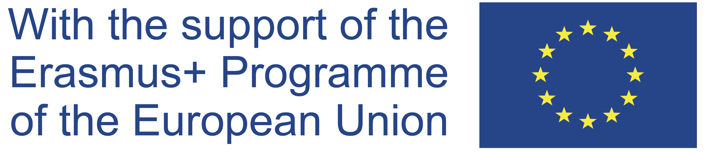

	

# Governing Council of the European Central Bank Corpus 1999-2018

This corpus covers all English language speeches made by members of the Governing Council of the European Central Bank from the period 1999-2014. It is published here as part of the outputs of the Jean Monnet Chair European Union Data and Democracy Project led by [Dr. James P. Cross](https://people.ucd.ie/james.cross). The project is hosted in the [Connected_Politics Lab](https://www.ucd.ie/connected_politics/) at University College Dublin and was completed in collaboration with [Dr. Derek Greene](https://people.ucd.ie/derek.greene).

If you make use of this corpus, please consider citing the associated paper:

- Greene, Derek, and James P. Cross. "Exploring the Political Agenda of the European Parliament Using a Dynamic Topic Modeling Approach." Political Analysis 25.1 (2017): 77-94. [PDF](http://derekgreene.com/papers/greene17europarl.pdf) [BibTeX](http://derekgreene.com/bib/greene17europarl.bib) [Preprint](https://arxiv.org/abs/1607.03055)

The published version of this study can be found [here](https://www.cambridge.org/core/journals/political-analysis/article/abs/exploring-the-political-agenda-of-the-european-parliament-using-a-dynamic-topic-modeling-approach/BBC7751778E4542C7C6C69E6BF954E4B#article)

	

Disclaimer: The European Commission's support for the production of the material presented here does not constitute an endorsement of the contents, which reflect the views only of the authors, and the Commission cannot be held responsible for any use which may be made of the information contained therein.

